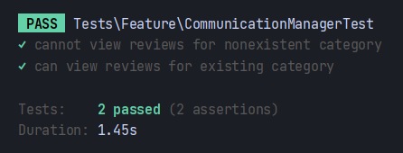
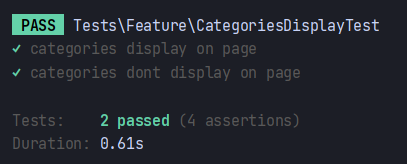

# Testing

## First User story
1. As a communication manager, I want to be able to see what people think about the marina throughout the years, so that I know what to improve for the future.
- Happy Path: **Given** that I am on the home page, **when** I click on the individual "Category" button, **then** I am taken to the category page.
- Unhappy Path: **Given** that I am on the home page, **when** I click on the individual "Category" button, **then** I am not taken to the category and I stay in the main dashboard.

- **V-model**: In the context of the V-Model, the acceptance test ensures that the communications manager is able to access the categories page by clicking on the "Show Categories" button, while the system tests validate both the happy and unhappy paths, checking if the manager is correctly redirected or remains on the main dashboard. Additionally, the unit test verifies that the categories page is displayed when the user attempts to access it.

## Design:
There is a side menu that contains all of the categories. When the user clicks on the category, he is taken to the category page. The category page contains all of the questions that are related to the category. The user can then click on the question and see the answers to the question. The user can also click on the back button and go back to the main dashboard.

## Implementation:
- The first test that I wrote was a feature test to see if when I pressed on the category, then I would be able to see the category page. I wrote the test in tests/Feature and called it CommunicationManagerTest.php.
- For the unhappy path I used the same file and just changed the test to see if I would not be taken to the category page, of a non-existent category.

## Testing
1. System Test: **Happy:** When the communications manager presses on the category button, he is taken to the category page.
2. System Test: **Unhappy:** When the communications manager presses on the category button, he is not taken to the category page.
3. Unit Test: When the users tries to access the category page, the category page is displayed.

## Conclusion
- Both Tests passed, as the category page exists and the user is able to see it.
- This test is important for the project because it is the first step in the process of the communication manager being able to see what people think about the marina throughout the years. The communication manager needs to be able to see the categories in order to see the questions that are related to the category. 
- To improve this test, next time I would, instead of using the same file for the happy and unhappy path, I would create a new file for the unhappy path. This would make the code more readable and easier to understand.

## Second User story
2. As a communications manager, I want to be able to see all the categories in which the marina is divided into, so that I can see what people think about the marina in each category.
- Happy Path: **Given** that I am on the home page, **when** I click on the "Show Categories" button, **then** I am taken to the page with the full list of categories.
- Unhappy Path: **Given** that I am on the home page, **when** I click on the "Show Categories" button, **then** I am not taken to the page with the full list of categories and I stay in the main dashboard.

- **V-model**: In the context of the V-Model, the acceptance test ensures that the communications manager is able to access the categories page by clicking on the "Show Categories" button, while the system tests validate both the happy and unhappy paths, checking if the manager is correctly redirected or remains on the main dashboard. Additionally, the unit test verifies that the categories page is displayed when the user attempts to access it.

## Design:
- On the side menu, there is a button that takes you to the list of categories. When the user clicks on the button, he is taken to the categories page. The categories page contains all of the categories that the marina is divided into. The user can then click on the category and see the questions that are related to the category. The user can also click on the back button and go back to the main dashboard.

## Implementation:
- The first test that I wrote was a feature test to see if when I pressed on the 'Show Categories' button, then I would be able to see the categories page. I wrote the test in tests/Feature and called it CategoriesDisplayTest.php.

## Testing
System Test: **Happy:** When the communications manager presses on the show categories button, he is taken to the categories page.
System Test: **Unhappy:** When the communications manager presses on the show categories button, he is not taken to the categories page.
Unit Test: When the users tries to access the categories page, the categories page is displayed.

## Conclusion
- Both Tests passed, as the categories page exists and the user is able to see it.
- This test is important for the project because it is the process in which the communication manager is able to see what people think about the whole marina. The communication manager needs to be able to see the categories in order to see the questions that are related to the category.
- To improve this test, next time I would make sure that the test is more specific. I would also make sure that the test is more readable and easier to understand.
